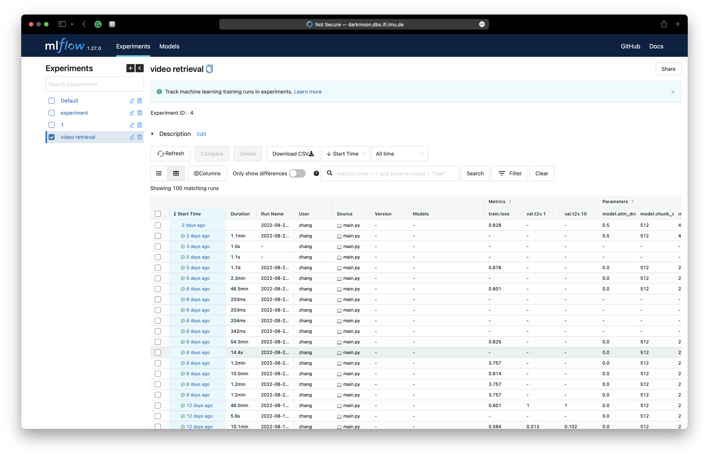
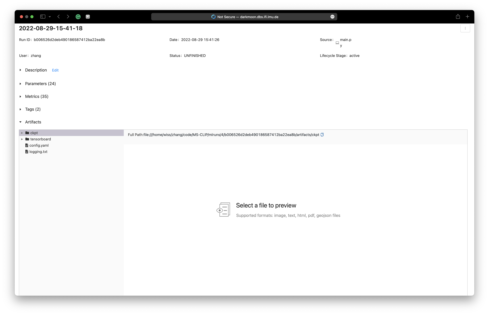

## My customised deep learning project template
Contributer: Gengyuan Zhang 

Contact: gengyuanmax@gmail.com


### About this project
I create a deep learning project template to help me to start a new project with convenient logging and visualization supported by [mlflow](https://mlflow.org/) and [tensorboard](https://github.com/lanpa/tensorboardX).

It includes:

- [x] training/testing/resuming a new task 

- [x] saving all checkpoints and artifacts to a local directory including git commit version, config file copy, metrics etc.

- [x] generate a new experiment folder once submitting a new script

- [x] using Distributed Data Parallel to realisze one-node multi-gpu training


### How to Use
1. Define your model that inherits ConfigModel class
2. Define your trainer in main.py
3. Start mlflow server
```shell
mlflow ui -h 0.0.0.0 -p 5055
```

4. Start 
tensorboard server'
```shell
tensorboard --host 0.0.0.0 --logdir mlruns/{run_id}
```


### How it's like
Mlflow can help manage all the experiments and details.



